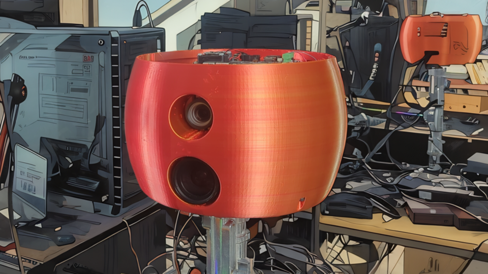

# PolieBotics

*Projector–camera systems that bind **physical interactions** to **committed, auditable evidence**.* Patent pending · all rights reserved.

**Part of the PolieBotics project.** Live sites: [truthbeam.com](https://truthbeam.com) (the verifiable core) · [poliebotics.com](https://poliebotics.com) (this umbrella, the generalised system) · [poliepals.com](https://poliepals.com) (the exploration layer). GitHub org: [github.com/poliebotics](https://github.com/poliebotics).

> **See for yourself — ~2 minutes, no GPU, no login, no GitHub, nothing to buy.** The headline result is
> *recomputable from public files.* Fetch the self-contained bundle from **truthbeam.com** and run it:
> `curl -fsSL https://data.truthbeam.com/release/truthbeam_verify.tar.gz | tar xz && cd truthbeam_verify && bash verify_all.sh`
> — it recomputes **AUROC = 1.000** *and* independently re-checks the on-chain temporal binding
> (RSK-mainnet anchor transactions + drand signatures) + random-frame hashes, all from public URLs. No
> token, no gated weights, no "DM for the real files." **Scams ask you to trust; this asks you to
> recompute.** (Even the time-binding alone is confirmable just by opening a block explorer — no code.)

> **How this is written — provenance & error.** The **patent filings**
> ([`reality_kernel/`](reality_kernel/)) are **authoritative on themselves** — the citation for their
> own claims, and nothing more. They are **human-authored *through* an LLM** (the inventor directs,
> reviews, and is responsible — Filing 1 discloses the AI drafting assistance), authoritative because
> **filed and inventor-reviewed**, not because no model touched them. The **published dataset**
> ([`DOWNLOADS.md`](DOWNLOADS.md)) and the **hand-made 2023 video** ([`PolieBotics.mp4`](DOWNLOADS.md),
> committed by hash) are **evidence to be checked, not authorities.** Beyond these there is **no other
> real authority** — verify for yourself. **Everything else — this
> README, the component summaries, and the [FAQ](FAQ.md) — is largely
> generated by prompted large language models, and is written to be read by them too** (the project
> assumes much of its audience arrives through an LLM). Treat that prose as a *derived, lossy
> rendering*, not the source. Error or deviation can enter at **every step of the chain — human (the
> original messages and the technology), human→machine (prompting), machine→machine (one model
> handing to another), and machine→human (reading it back)** — so a summary may drift from the
> original intent and from the underlying tech. **When it matters, verify against the filings, the
> dataset, and the video yourself** — they are the primary records, and your own check is the only
> real authority. This is the project's own discipline turned on itself:
> commit the evidence, show it, let it be checked — never take the summary's word for the thing.

The authoritative technical description and the patent filings (Filing 1 & Filing 2) live in
[`reality_kernel/`](reality_kernel/). The example dataset (two ground-truth sessions, ~378 GiB, every file
directly downloadable) is indexed in [`DOWNLOADS.md`](DOWNLOADS.md). Common questions — including what is
and is *not* claimed — are answered in [`FAQ.md`](FAQ.md). The sections below are tight summaries
of how the patent treats each topic.

This project keeps **three layers** deliberately apart, and **this repo is the technology layer.**
(1) The **technology** — the real, patent-pending system — is described soberly here and at
[truthbeam.com](https://truthbeam.com). The other two live entirely at
**[poliepals.com](https://poliepals.com)**, kept separate from the tech and **never offered as evidence
for it**: (2) the **fiction** — the *PoliePals* co-creative game (you join as Iris / Eve / Demeter /
Harmonia) — and (3) the author's personal **testament** (his first-person account, offered as *testimony*,
**never as proof**). None adjudicates the others; **your own engagement with reality is the final
authority.**

Supporting the work is **entirely optional** — voluntary gifts, with **no token, security, or return
offered or sold**. If you'd like to, [`SUPPORT.md`](SUPPORT.md) has the details; it also carries the
project's **GPG key and fingerprint** for verifying signed releases and sending encrypted mail.

## The Reality Kernel

The core is the **Reality Kernel**: a parameterised physical channel — formally a *Markov kernel* — that a
projector–detector **module** realises. An emitter sends structured probes (light, or any controllable physical
carrier) into a physical medium and a detector records what comes back, in a **closed cycle** where each observation
conditions the next emission. A run is committed as a **convolution bundle** — a time-ordered, multi-tap record of
*(emitted, observed)* pairs, logged under a *protocol digest* and *meter envelope* so it can be audited afterward. An
optional **reactor** (a nonlinear or memory-bearing medium in the optical path) can make the channel's transform
**empirically harder to reproduce** — under a declared attacker family, access model, and budget, not unconditionally
unique; a plain linear/identity reactor is equally valid where hardness is not the objective.
→ [`reality_kernel/`](reality_kernel/)

## Operating regimes

One front-end; three objective families, all read off the same convolution bundle:

- **[Truth Beam](truth_beam.md)** — *verification* ("who are you?"). Attests the provenance of the physical
  light-in / light-out interaction under declared threat models — **not** the semantic truth of a staged scene.
  ([example code](https://truthbeam.com) · [dataset downloads](DOWNLOADS.md) — two ground-truth sessions, ~378 GiB on R2; also content-addressed on IPFS — per-session CIDs in [`DOWNLOADS.md`](DOWNLOADS.md))
- **[Limager](limager.md)** — *perception* ("what is out there?"). Active sensing, 3D, and semantic analysis from the
  physical responses.
- **[Reality Transform](reality_transform.md)** — *controllable rendering* ("make it look like this"). Adaptive
  son-et-lumière projection constrained to the physical channel. ([example code](https://data.poliebotics.com/gallery/))

**Yoked** operation is an optional coupling *modifier* (not a fourth regime): device and scene are driven toward a
joint dynamical state, so the bundle encodes their coupled dynamics rather than static properties.

## Analogue & digital PolieBotics

PolieBotics is **one formalism, characterised to two different extents.** The Reality Kernel — a parameterised
physical channel modelled as a Markov kernel (emit → observe → commit) — governs the whole system: the digital
Truth Beam's projector→camera channel, Limager's output labels, Reality Transform, and digital-twin simulation of
the channel alike. The digital/analogue distinction is therefore **not** which parts the formalism covers — it covers
all of them — but **how fully each embodiment's envelope has been characterised**.

- **Digital PolieBotics — the demonstrated, maturing layer.** Its most mature piece is the **digital Truth Beam**: a
  BLAKE3 hash-chain seeds each projected pattern, anchored to **drand** and the **Rootstock (RSK)** blockchain and
  scored by a learned verifier — hardness that is **chain-committed and verifier-scored**, a *measured* quantity
  demonstrated at AUROC = 1.000 against a trained forger on a same-rig, two-session, single-performer corpus (~378 GiB; the
  metric is reported from the companion TruthBeam evaluation artifacts, not recomputable from the released dataset alone), even when
  the physical reactor is plain and linear. Around it sit the other digital regimes the same formalism drives — the
  earlier **Reality Transform** rendering runs (the inverse-mapping and pose-conditioned captures in the gallery),
  **Limager** perception, and digital-twin simulation of the channel for synthetic training data — the wider digital
  program.
- **Analogue PolieBotics — the same kernel in richer physical embodiments.** Physical-reactor hardness in nonlinear,
  memory-bearing media; **continuous low-latency analogue witness-mesh coupling**, intended so that the *joint* record
  across the mesh stays hard to forge even if a single module is attacked; and physical **son-et-lumière** rendering. These
  embodiments are described and **enabled in the filings**. Their performance and hardness **envelope is still being
  characterised** — boundaries still being probed, with headroom still to be mapped.

*One kernel throughout — described and enabled in the filings — with the analogue envelope simply the part still
being mapped.*

## Empirical hardness & meters

Security is grounded in **physical hardness, not computational-complexity assumptions**. Hardness is stated as an
*engineering* claim — committed physical evidence under declared attacker classes, compute budgets, and meter
envelopes, periodically recalibrated — not a formal, zero-knowledge, or reduction-based guarantee. **Meters** score
the bundle: verisimilitude discriminators (physical vs. synthetic), hardness estimators, calibration/drift probes,
and Yoked-coupling-quality meters. They bound what counts as admissible and gate model evaluation.

## Witness mesh

The principal deployment described in the filings is a **witness mesh**: several Reality Kernel modules linked by continuous,
**low-latency analogue couplings**, intended so that the *joint* record across the mesh stays hard to forge under bounded
adversaries even if a single module is attacked. (Modules can additionally exchange digital evidence and cross-verify
shared events as a separate networked mode.) A single module is a valid standalone building block.

## Cryptographic overlays (optional)

Optional attestation plumbing — commitment, timestamping, selective disclosure, aggregation — layered *on top of* the
convolution bundle to bind and govern exported evidence. The physical channel comes first; cryptography is the
carrier, not the grounding.

## Agents — PolieBots

An autonomous or semi-autonomous agent can use Reality Kernel modules as its primary **observation, verification, and
action-conditioning** channel, with **verification-gated actions** — it acts only on sufficient physical evidence.
"PolieBots" are mobile platforms carrying one or more modules. Higher-layer multi-agent coordination is the subject
of the related **Filing 2**.

## PoliePuter — physical computation

A use of the channel as a **physical computer**: optical matrix multiplication, 2D correlation, and
Fourier / fractional-Fourier transforms the kernel can realise directly in the optical medium. The broadest
extension of the kernel into physical computation — the part of the suite whose performance envelope is
still being characterised. → [computation.md](computation.md)

## Demonstration hardware — PolieProboscis

*(A current prototype/reference rig — operational hardware, not part of the patent's claims; the filings describe a
generic compact projector–detector probe.)* The rig pairs an **EKB Technologies RGB DLP 4750LC** projector (1000 lm,
on-axis) hardware-triggering an **Imaging Source DFK 38UX540** camera with an **Edmund Optics 16 mm f/2.8 HPi+** lens;
an inertial measurement unit (IMU) is planned. A 3D-printable model — the **hinged DFCP SPHERIC**
revision (body, top cover, hinge pins), with thanks to Alfonso Gonzalez (named with his consent) — is in
[`proboscis/`](proboscis/PolieProboscis_DFCP_Spheric_hinged_20260116.zip), included **for reference,
not yet test-printed**.

## Patent & rights

The system is patent pending. The parent application is published as **WO 2025/046153 A2** (*Methods and Apparatus
for Projector Camera Systems*); PIGMIE **Filing 1** develops it into the Reality Kernel apparatus and **Filing 2**
adds runtime governance. All three are included in [`reality_kernel/`](reality_kernel/); inventor/applicant
**Cathal Ryan Hynes** (P.I.G.M.I.E. Ltd).

**All rights reserved. Statement of intent (non-binding; not a licence or grant):** the author intends to make a
research- and personal-use licence available and is preparing terms. Until a written licence is offered, no licence
is granted by this publication; contact the author (xathal@protonmail.com) for research/personal-use permission.

*Trade marks — Intellectual Property Office of Ireland; proprietor Cathal Ryan Hynes / P.I.G.M.I.E. Ltd.
**Registered (®):** PolieBotics (269817), Truth Beam (264324), Reality Transform (264371), PoliePuter
(268617), PolieProboscis (264276), P.I.G.M.I.E. (269723), PoliePals (264325), and PolieBot / The PolieBots
(264363 / 269642). **Applied-for (™, not yet registered):** Reality Kernel (2025/03255, pending), Narravite
(274828, accepted), and Limager (applied-for — filed 2026-06-18 in classes 41, 9 and 42; the related mark
"Limage", 270047, is the one on the register). Use ™ for the applied-for marks and ® only for the registered ones.
Full canonical table: [`TRADEMARKS.md`](TRADEMARKS.md).*

---

## Status, reproduction & where this is going

**Published as a stable snapshot (mid-2026).** The author is moving on to other work for the next few
months, so issues, PRs, and email may go unanswered for a while — *by design, not neglect*: everything
here is built to be checked **without us**. Recompute the results, re-walk the chain, and verify against
the filings, dataset, and video yourself.

**Independent reproduction is the contribution we most want.** Pull the open data, run the verification,
and — the real test — **bring your own rig, performer, or forger** and try to break it. Re-implementations,
forks, and collaboration are explicitly welcome while we're heads-down elsewhere.

**Direction.** This single-rig release is the foundation. The filings **describe and enable** a larger
**cross-rig witness mesh** — several Reality Kernel modules cross-checking one shared record — and the
intent, over time, is to open a **public standard and reference modules** and to work with other
researchers, so independent instruments can interoperate and verify each other. None of that is claimed
as done here; it is the **trajectory and the open door**.
