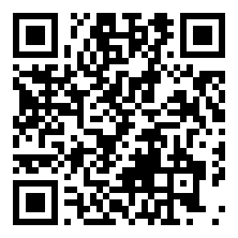
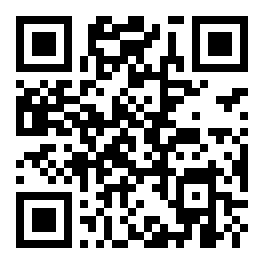

# Support PolieBotics

PolieBotics is released as a public good — the instruments, the filings, and (as consent and timing
allow) the dataset. If the work is useful to you and you'd like to help sustain it, contributions to the
addresses below are **welcome and entirely voluntary**.

> **Not an offering.** Contributions are **gifts** — **no crypto asset, token, security, or investment is
> offered or sold**, and nothing promises any financial return.

> **Verify before you send.** Every address here has been **checksum-validated** and its destination
> **confirmed on the signing device**. But a web page can be tampered with — so trust the
> **GPG-signed** copy of this list and the **fingerprint** published across our other channels
> (repository, video description, social), not any single page in isolation. When in doubt, confirm
> the fingerprint below matches in more than one place.

## Addresses

### Bitcoin — BTC
```
bc1qudu78mftndgx658mwamx2mvsyykya87rp6zw68
```
Native SegWit (bech32). 



### Ethereum & Rootstock — ETH / RSK
One address, both EVM chains (same 20 bytes):
```
0x1dc6dB685ba680b3548B159430C009fA81fEC335
```
- **ETH** (EIP-55): `0x1dc6dB685ba680b3548B159430C009fA81fEC335`
- **RSK** (RSKIP60): `0x1dC6dB685bA680B3548b159430c009Fa81fec335`

Send **ETH / ERC-20** on Ethereum, or **RBTC** on Rootstock — both arrive at the same wallet.



## Verify it's really us — PGP / GPG

Official PolieBotics releases and communications are signed with a key the operator attests is
**hardware-backed** (held on a hardware token; the private key is not exported):

**Fingerprint**
```
A8DC 9A41 F927 6260 1892  A646 ABFD 37A9 F45A 5286
```
- Public key: [`keys/xathal_gpg.asc`](keys/xathal_gpg.asc)
- Algorithm: **Ed25519** (signing) + **Curve25519/cv25519** (encryption)

Import and check the fingerprint:
```sh
gpg --import keys/xathal_gpg.asc
gpg --fingerprint A8DC9A41F92762601892A646ABFD37A9F45A5286
```
Then confirm that fingerprint matches the one published in our **other** channels before you trust
anything signed by it. You can also use this key to send us **encrypted** mail.

---

*Contact details and keys may rotate over time; when they do, the change will be **signed by the
current key**. Always anchor trust to the fingerprint, verified across multiple channels — not to any
one address or page.*

<sub>*Supporters may, optionally, receive a small commemorative digital "first edition" as a gesture of
thanks — a keepsake, not a financial instrument: no ownership, revenue, redemption, or expectation of
profit.*</sub>
