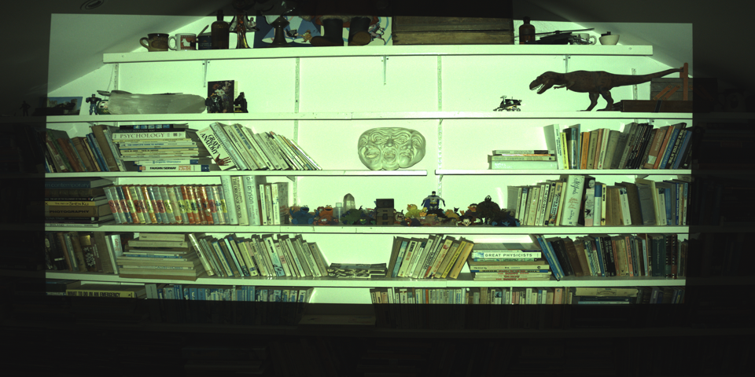
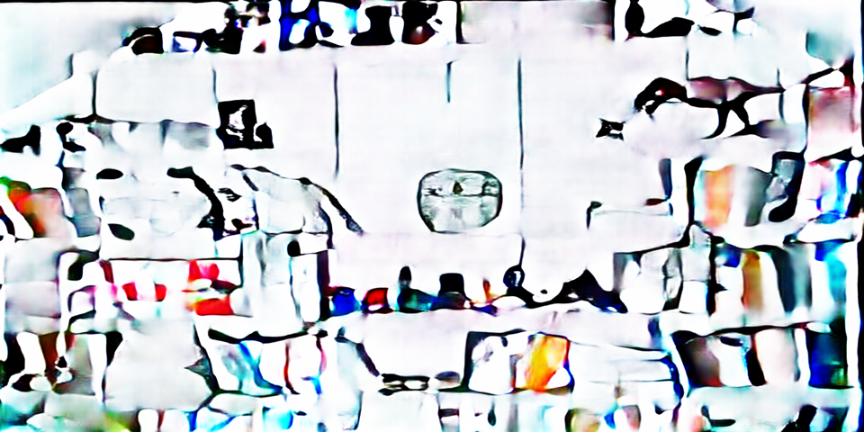
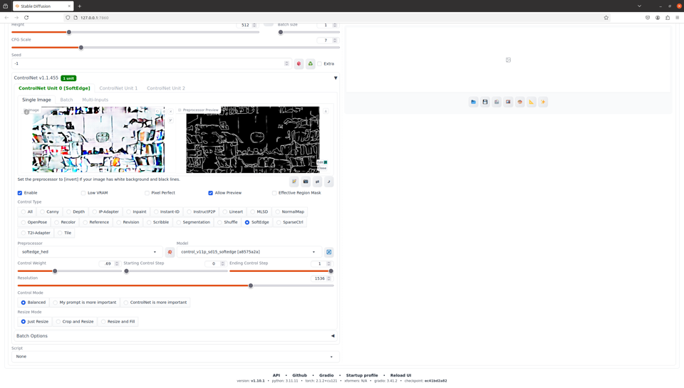
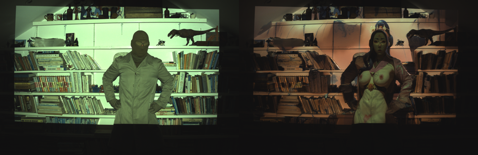
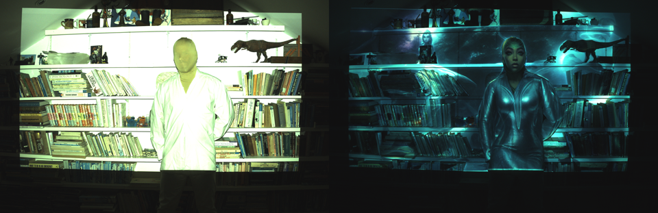

# Reality Transform — the controllable-rendering regime

*The controllable-rendering operating regime of the [Reality Kernel](reality_kernel/). Patent pending; all rights
reserved.*

Reality Transform runs the Reality Kernel to **act on** a scene — *"make it look like this."* It projects adaptive
light (son-et-lumière mapping onto people, objects, or buildings) that is **constrained to the physical channel**: in
some embodiments it minimises the divergence between the achieved output and a target, subject to **meter
envelopes**, while sensor feedback continuously refines brightness, colour, and pattern.

Because it shares the Reality Kernel's front-end and **convolution-bundle** record with verification and perception,
a rendering run is auditable and can be interleaved with the other regimes (e.g. sense, then render to match).

## Reference implementations — evolutionary steps

The earliest rendering loops' **operating envelope depended on style, environment, and training data** —
**unpaired, single-shot iterations** that could accumulate drift. Characterising that envelope is what
motivated the stabilising step below.

Stability came from **multiplexed paired acquisition** (disclosed in the WO patent): a **neutral probe
emission** and a **styled emission** put on the same scene and read as a **stereo pair** — one view the
neutrally-lit read, the other the projected style — recovered as **paired (probe, style) captures** bound
to the same scene instant. Because each cycle re-anchors on an independent neutral probe instead of
learning from its own drifted output, the multiplexed loop sidesteps the compounding-drift failure of the
single-shot loops. The choice of style transfer is what tips it: empirically, an **edge-preserving**
style transfer lets the stereo-pair trick yield a **well-conditioned training corpus** straight from
the physically-captured pairs, so there is no need to separately generate simulated-loop training
data. *(The **dataset** is the deterministic part — it falls out of the multiplexed capture directly.
Agents **trained** on it are only **stochastically** stable — usually steady, sometimes drifting, and
now and then settling into interesting **resonances** — not inherently stable.)*

The runtime styler's training data was a **mix**: those single-shot loops, the paired stereo corpus,
and **modified neutral projections** captured through the physical channel — optionally screened by a
**verisimilitude checker** — to seed synthetic training data for agents. In the **slow-teacher /
fast-student** pattern, an expensive styler generated offline emissions, projected them onto a stable scene
and captured them, then a **fast runtime student** learned to reproduce the captured *physical* response
(inheriting the channel's transfer function).

The working stable demonstration (WO 2025/046153 A2 era) ran a **basic, edge-preserving fast
style-transfer** student; compute of the time held it to **simple styles**. The
[RealityTransform](https://github.com/poliebotics/RealityTransform) repo reaches further — learning the
scene's *inverse response* with **pix2pixHD** (Wang et al., NVIDIA/Berkeley), with **human-body
pose-conditioning via OpenPose ControlNet**, guided through **ComfyUI / Stable Diffusion** — but those richer-style
experiments ran as a **single-step, slow loop** and were the least stable of the lot. Probe textures came
from the **Describable Textures Dataset**; much of the scaffolding is upstream code with light modification.

Together they are the lineage into the current Reality Kernel formulation, which supersedes both.

**Inverse-mapping example** — a cropped camera-side step response and the model's predicted emission:

|  |  |
| :--: | :--: |
| Step response (camera view) | Predicted emission |

Predicted emission fed through ControlNet stylisation:

A couple of captured iterations (industrial camera; may look dull to the eye):

|  |  |
| :--: | :--: |

**Full gallery (47 captures, hosted on R2):** [`rt_samples/GALLERY.md`](rt_samples/GALLERY.md).

See [`reality_kernel/`](reality_kernel/) for the authoritative description.
